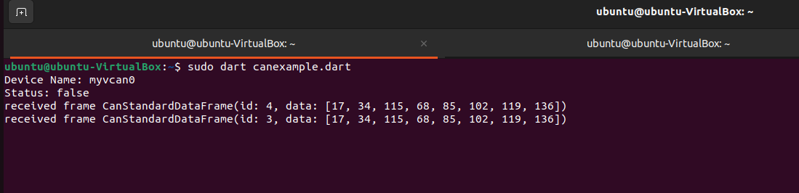

# DartCANReader

A minimal Dart program demonstrating CAN frame reading.



## Linux CAN

This example uses the [linux_can](https://pub.dev/documentation/linux_can/latest/) Dart library to interact with Controller Area Network (CAN) frames.

## Setting Up Virtual CAN (vcan)
To test the CAN frame reading, you can create a virtual CAN interface and send a sample CAN message. Follow these steps:

1. Create a virtual CAN interface named '**myvcan0**':

```bash
sudo modprobe vcan
sudo ip link add dev myvcan0 type vcan
sudo ip link set up myvcan0
```
2. Install the **can-utils** package to get the **cansend** tool:

```bash
sudo apt-get install can-utils
```

3. Send a sample CAN message using **cansend**:
```bash
cansend myvcan0 123#11223344AABBCCDD
```
This sends a message on **myvcan0** with the identifier **123** and data **11223344AABBCCDD**.